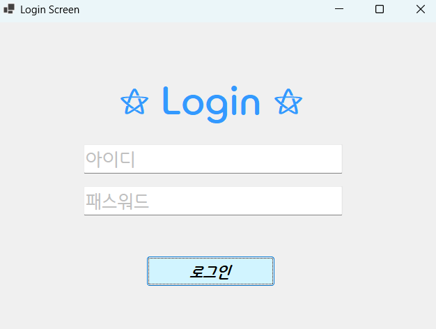
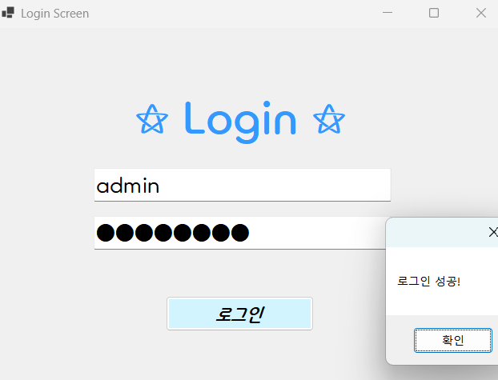
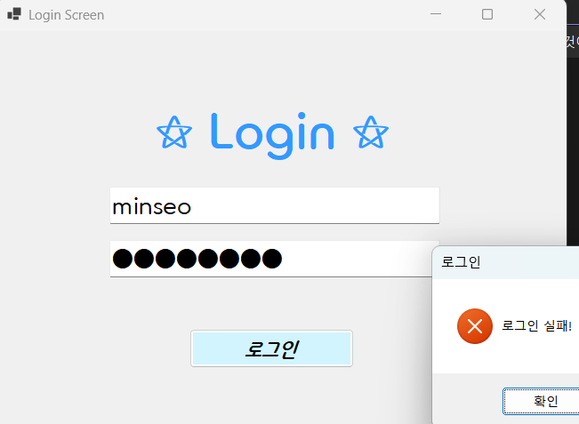

# [C# 코딩] 로그인 화면

## 개요
- C# 프로그래밍 학습
- 1줄 소개 : if문을 활용한 로그인 화면 구현.
- 사용한 플랫폼 : C#, .NET Windows Forms, Visual Studio, Github.
- 사용한 컨트롤: Button, TextBox, Label, MessageBox.
- 사용한 기술과 구현한 기능 : 아이디와 패스워드 입력, 로그인 버튼 클릭 이벤트 처리, 로그인 성공/실패 메시지 표시.

## 실행 화면 (과제1)
- 과제1 코드의 실행 스크린 샷

기본적인 UI구성, Placeholder로 아이디와 패스워드 입력 안내, 로그인 버튼이 배치된 화면

성공적으로 로그인한 경우의 메시지 박스 화면

로그인 실패한 경우의 메시지 박스 화면

- 과제 내용
	- 컨트롤 배치와 기본적인 속성 설정
	- 입력창 안내하는 기능 구현
	- 아이디와 패스워드 처리 기능 구현

- 구현 내용과 기능 설명
	- 기본 UI 배치 및 기능을 구현하였습니다.
	- TextBox(아이디, 패스워드), Button(로그인) 등을 배치하였습니다.
	- Placeholder를 표시하여 아이디와 패스워드 입력 힌트를 표시하였습니다.
	- 로그인 가능 여부를 체크할 수 있도록 합니다.
	- 로그인 성공/실패 메시지 박스를 띄웁니다.
	- Tab키를 이용한 상호간의 이동, Enter키를 눌렀을 때 로그인 버튼이 클릭되도록 설정하였습니다.
